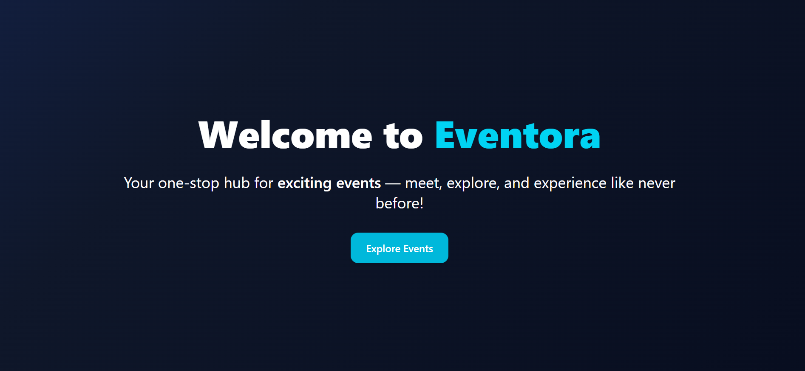
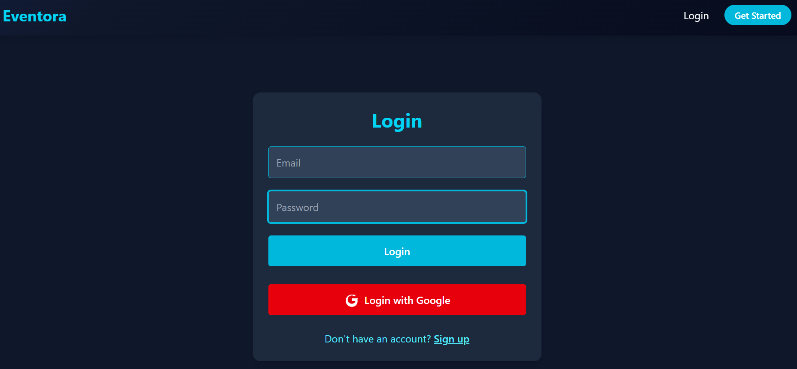
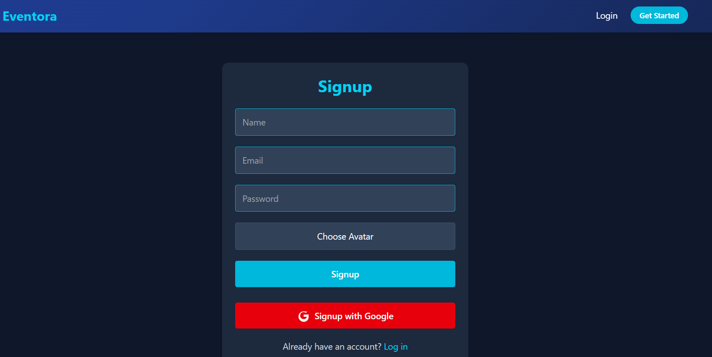
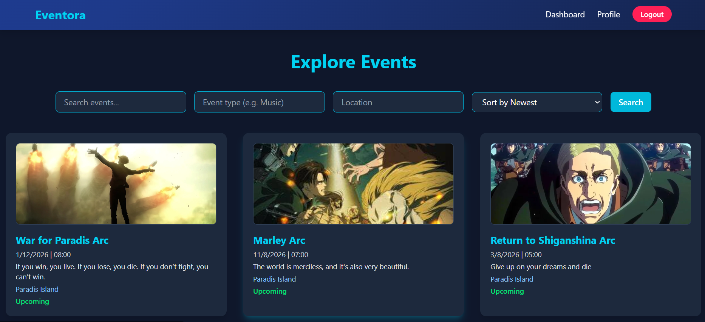
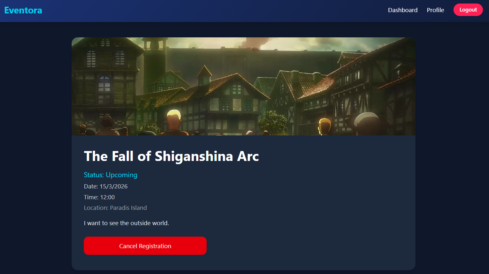
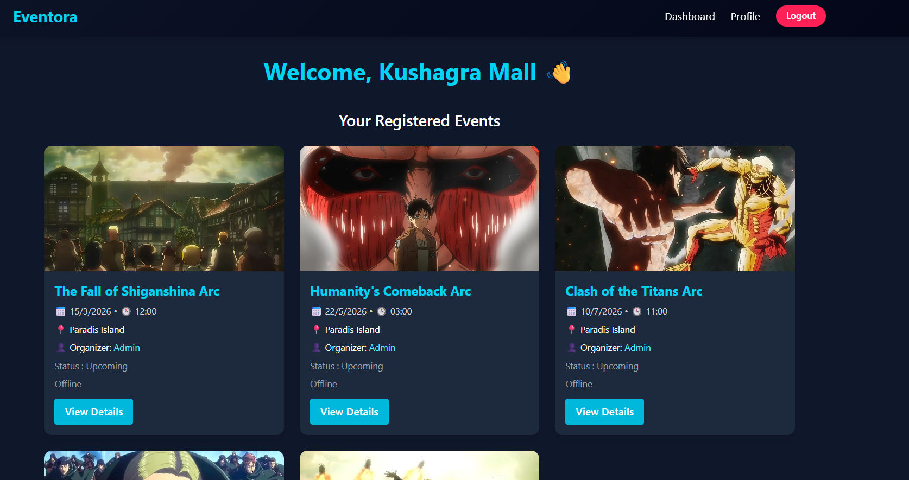
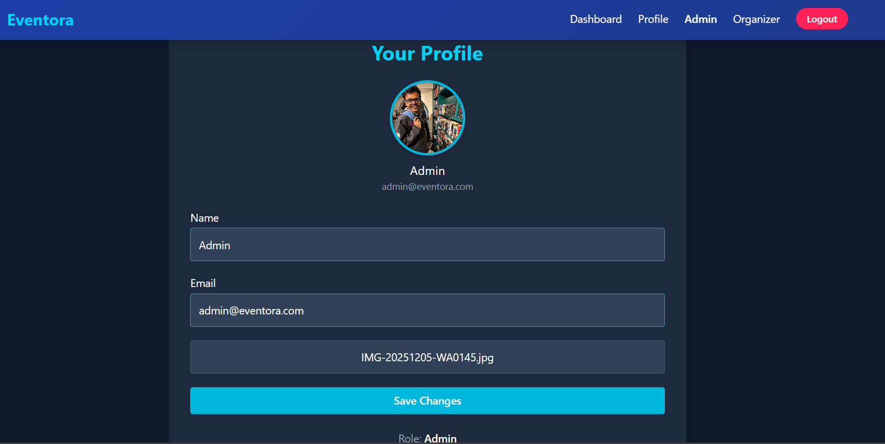
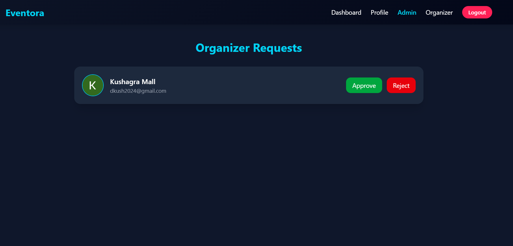
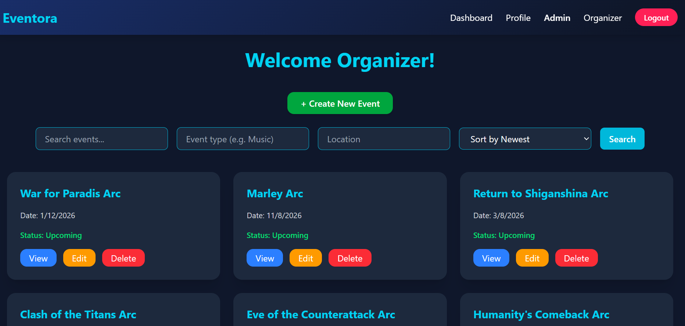

# Eventora

**Eventora** is a full-stack Event Management Platform that allows organizers to list events, users to register for them, and admins to manage the overall platform. It integrates a range of modern technologies to deliver a seamless, scalable, and feature-rich experience.

## Features

- Organizers can create and manage events.
- Users can browse and register for events.
- Organizers can view registration details.
- Admin panel for moderation and management.
- Google Login via Firebase.
- Email notifications for event registration and reminders.
- Cron jobs to automate reminders and event status updates.
- Rate limiting and caching with Redis.
- Image uploads and storage via Cloudinary.

## Tech Stack

- **Frontend**: React, Tailwind CSS
- **Backend**: Node.js, Express.js
- **Database**: MongoDB
- **Authentication**: Firebase (Google OAuth)
- **Email Services**: Nodemailer
- **Image Hosting**: Cloudinary
- **Caching & Rate Limiting**: Redis
- **Scheduled Tasks**: Cron Jobs

## Installation & Setup

> Make sure you have Node.js and npm installed on your machine.

### 1. Clone the repository

```bash
git clone <your-repo-url>
cd Eventora
```

### 2. Backend Setup

```bash
cd server
npm install
```

- Create a `.env` file in the `server` directory with all required environment variables (e.g., MongoDB URI, Firebase credentials, Cloudinary keys, etc.).

- Start the server:

```bash
npm start
```

### 3. Frontend Setup

```bash
cd ../client
npm install
```

- Create a `.env` file in the `client` directory with all required environment variables.

- Start the client:

```bash
npm start
```

### 4. Open the app

Visit [http://localhost:5173](http://localhost:3001) in your browser.

## 📄 Example .env Files

### Client (`client/.env`)

```env
VITE_CLOUDINARY_UPLOAD_PRESET=your_upload_preset
VITE_CLOUDINARY_CLOUD_NAME=your_cloud_name
VITE_FIREBASE_API_KEY=your_firebase_api_key
VITE_FIREBASE_AUTH_DOMAIN=your_auth_domain
VITE_FIREBASE_PROJECT_ID=your_project_id
VITE_FIREBASE_STORAGE_BUCKET=your_storage_bucket
VITE_FIREBASE_MESSAGING_SENDER_ID=your_sender_id
VITE_FIREBASE_APP_ID=your_app_id
```

### Server (`server/.env`)

```env
PORT=5000
MONGO_URI=your_mongo_connection_string
JWT_SECRET=your_jwt_secret
EMAIL_USER=your_email_address
EMAIL_PASS=your_email_password_or_app_password
REDIS_URL=your_redis_url
```

## 📸 Screenshots / Demo

### 🔗 Live Site
[Visit Eventora](<your-deployed-url>)

### 🖼️ Screenshots

#### Landing Page


#### Login Page


#### Signup Page


#### Explore Events Page


#### Event Details Page


#### Dashboard


#### Profile Page


#### Admin Organizer Requests


#### Organizer Event Management

## 👤 Author

**Kushagra Mall**

## 📜 License

This project is not currently under any license.

